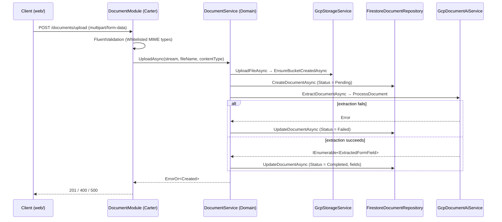

<!-- intent-skills:start -->
## Skill Loading

Before editing files for a substantial task:

- Run `bunx @tanstack/intent@latest list` from the workspace root to see available local skills.
- If a listed skill matches the task, run `bunx @tanstack/intent@latest load <package>#<skill>` before changing files.
- Use the loaded `SKILL.md` guidance while making the change.
- Monorepos: when working across packages, run the skill check from the workspace root and prefer the local skill for the package being changed.
- Multiple matches: prefer the most specific local skill for the package or concern you are changing; load additional skills only when the task spans multiple packages or concerns.
<!-- intent-skills:end -->

# AGENTS.md

Guidance for AI coding agents working in this repository. Read this before making
changes. For human setup instructions, see [README.md](./README.md).

---

## 1. Project Overview

**Document Processing Pipeline** is an end-to-end, cloud-native document pipeline:
upload a document → store it in object storage → extract form fields with OCR →
persist structured results → serve the frontend.

Built on **.NET 10 / .NET Aspire** with **Google Cloud** (Document AI, Cloud Storage,
Firestore) and a **TanStack Start / React 19** frontend. Local development runs
containerized emulators instead of touching real GCP resources.

---

## 2. Repository Layout

| Path                                                      | Responsibility                                                                                                                                                                                                                               |
| --------------------------------------------------------- | -------------------------------------------------------------------------------------------------------------------------------------------------------------------------------------------------------------------------------------------- |
| `DocumentProcessingPipeline.AppHost/`                     | .NET Aspire orchestrator: wires emulators, the API, and the Vite dev server together. Also holds the reusable `Document AI` WireMock fixture.                                                                                                |
| `DocumentProcessingPipeline.Server/`                      | ASP.NET Core host: Carter modules, FluentValidation validators, OpenAPI/Scalar, OpenTelemetry service defaults, health endpoints.                                                                                                            |
| `DocumentProcessingPipeline.Server.Domain/`               | Clean-architecture core: `Document` models, `IDocumentService`/`IStorageService`/`IOcrService`/`IDocumentRepository` interfaces, `DocumentService`. Only external dependencies are `ErrorOr` and `Microsoft.Extensions.DependencyInjection`. |
| `DocumentProcessingPipeline.Server.Infrastructure/`       | Implementations for GCS (`GcpStorageService`), Firestore (`FirestoreDocumentRepository` + entities), Document AI (`GcpDocumentAiService`), and `GcpOptions`/`DocumentAiOptions`.                                                             |
| `DocumentProcessingPipeline.Server.Domain.Tests/`         | Unit tests for domain logic (Moq-based).                                                                                                                                                                                                     |
| `DocumentProcessingPipeline.Server.Infrastructure.Tests/` | Unit tests for GCP service/repository implementations and entity mapping.                                                                                                                                                                    |
| `DocumentProcessingPipeline.Server.Tests/`                | Integration tests: `WebApplicationFactory` + Testcontainers (Firestore, fake-gcs-server, WireMock gRPC).                                                                                                                                     |
| `web/`                                                    | TanStack Start frontend (React 19, Vite, Tailwind 4, shadcn/radix, bun).                                                                                                                                                                     |

Dependency direction is strictly one-way:
`Server → Infrastructure → Domain` and `Server → Domain`. **Never** make `Domain`
depend on `Infrastructure` or on ASP.NET Core.

---

## 3. Technology Stack

Pinned by [global.json](./global.json) and [mise.toml](./mise.toml).

| Area                 | Technology                                                                                          |
| -------------------- | --------------------------------------------------------------------------------------------------- |
| Runtime              | .NET SDK `10.0.0` (rollForward `latestMajor`), `nullable` + implicit usings enabled                 |
| Tooling              | mise (dotnet, bun, node, java), Docker/Podman via Aspire                                            |
| API                  | Carter 10, FluentValidation 12, `Microsoft.AspNetCore.OpenApi` 10, Scalar.AspNetCore 2              |
| Resilience/Telemetry | `Microsoft.Extensions.Http.Resilience`, ServiceDiscovery, OpenTelemetry (OTLP exporter)             |
| Results              | `ErrorOr` 2.1                                                                                       |
| GCP                  | `Google.Cloud.DocumentAI.V1` 3.25, `Google.Cloud.Firestore` 4.4, `Google.Cloud.Storage.V1` 4.15     |
| Backend tests        | xunit.v3 3.2, Moq 4.20, Bogus 35.6, Testcontainers 4.14, WireMock.Net 2.15                          |
| Frontend             | React 19, TanStack Start/Router, Vite 8, Tailwind CSS 4, radix-ui, lucide-react, Nitro (bun preset) |
| Frontend tests       | vitest 4, Testing Library, jsdom, ESLint (`@tanstack/eslint-config`), Prettier                      |

---

## 4. Commands

Run all commands from the repository root unless noted.

### Backend

```bash
dotnet build                                        # restore + build the solution
dotnet test                                         # all test projects, Debug
dotnet test -c Release                              # same as the mise/CI task
mise run server-test                                # CI equivalent: dotnet test -c Release
mise run server-test-coverage                       # tests + coverlet + ReportGenerator -> ./coverage
dotnet run --project DocumentProcessingPipeline.AppHost    # full stack + emulators
dotnet run --project DocumentProcessingPipeline.Server     # API only (http://localhost:5328)
```

Prefer running a single test project while iterating, e.g.
`dotnet test DocumentProcessingPipeline.Server.Domain.Tests`.

### Frontend (`web/`)

```bash
cd web
bun install           # install dependencies
bun run dev           # vite dev on port 3000
bun run build         # vite build
bun run test          # vitest run
bun run test:coverage # vitest run --coverage (istanbul, writes web/coverage)
bun run lint          # eslint
bun run typecheck     # tsc --noEmit
bun run format        # prettier --write
bun run check         # prettier --check
```

From the repo root, `mise run web-test` and `mise run web-test-coverage` are the CI
equivalents (they install dependencies first, then run `bun run test` /
`bun run test:coverage`).

### API documentation

Available only in the `Development` environment:

- Scalar UI: `/scalar/v1`
- OpenAPI document: `/openapi/v1.json`

---

## 5. Architecture & Request Flow



Key points:

- `DocumentService` owns the orchestration order; the module never calls infrastructure
  directly.
- Object keys are `documents/{documentId}/{fileName}_{yyyyMMddHHmmss}`.
- Bucket is created lazily on first upload (`EnsureBucketCreatedAsync` tolerates HTTP 409).
- The failure path writes `Status = Failed` with `CancellationToken.None` so the status
  update survives client disconnects — preserve this behavior.

### Local development wiring

`AppHost.cs` starts three dependencies and injects their coordinates into the server:

| Resource        | Image / mechanism                    | Environment variable        |
| --------------- | ------------------------------------ | --------------------------- |
| `cloud-storage` | `fsouza/fake-gcs-server` (:4443)     | `STORAGE_EMULATOR_HOST`     |
| `firestore`     | `google/cloud-sdk:emulators` (:4444) | `FIRESTORE_EMULATOR_HOST`   |
| `document-ai`   | WireMock (`AsHttp2Service()`)        | `Gcp__DocumentAi__Endpoint` |

The `web` Vite app is added via `AddViteApp(...).WithBun()` and, on publish,
`PublishWithContainerFiles(web, "wwwroot")` copies its output into the server's
`wwwroot`, which `Program.cs` serves via `UseFileServer()`.

---

## 6. Backend Conventions

- **Namespaces match folders**; file-scoped namespaces throughout.
  Types that belong together may share a file (e.g. `FirestoreDocumentEntity.cs` holds the
  entity records plus the `ToEntity()` mapper; `UploadDocumentRequest.cs` holds the request
  record plus its validator) — keep that grouping, but don't append unrelated types to a file.
- **Primary-constructor DI** for classes with no other constructor logic, e.g.
  `public class GcpStorageService(StorageClient c, ILogger<GcpStorageService> l, IOptions<GcpOptions> o)`.
- **Registration uses `extension(IServiceCollection)` blocks** inside each project's
  `DependencyInjection.cs`. Add new services to the existing
  `AddDomain()` / `AddInfrastructure()` chains rather than registering them in `Program.cs`.
- **All fallible operations return `ErrorOr<T>`.** Return `Result.Success` / `Result.Created`
  / `Result.Updated` on success and `Error.Failure("Scope.Operation", "...")` on failure.
  Compose errors with `.Errors`, and unwrap with `.Match(...)` at the API boundary.
- **Models are `record`s** with `required` + `init` members and collection defaults of `[]`.
  Domain enums are persisted as `ToString()`.
- **API endpoints live in Carter modules** (`Modules/*Module.cs`).
  Always declare the contract explicitly: `.Accepts<T>()`, `.Produces(...)`,
  `.ProducesValidationProblem()`, `.ProducesProblem(...)`, `.WithTags(...)`, `.WithName(...)`,
  `.IncludeInOpenApi()`.
- **Validators are colocated with their request model** (see
  `Models/UploadDocumentRequest.cs`) and are discovered by
  `AddValidatorsFromAssemblyContaining<Program>()`. Call them explicitly in the endpoint
  and translate failures with `TypedResults.ValidationProblem(validationResult.GetValidationProblems())`.
- **Persistence entities are separate records** marked `[FirestoreData]` with explicit
  `[FirestoreProperty("camelCase")]` names, converted via a `ToEntity()` extension in the
  same file. Never persist domain models directly.
- **Error handling:** wrap external calls in `try/catch`, log with the
  `TypeName.MethodName: message` prefix convention, and convert to `ErrorOr` failures.
  Let `app.UseExceptionHandler()` handle anything that escapes.
- **Health/telemetry** come from `AddServiceDefaults()` in `Extensions.cs`. Health
  endpoints (`/health`, `/alive`) are mapped **only in Development** — do not expose them
  elsewhere without reviewing the security implications noted in that file.

---

## 7. Frontend Conventions (`web/`)

- **File-based routing:** add routes as files under `web/src/routes/`.
  `routeTree.gen.ts` is generated by the TanStack Router plugin — never edit it by hand.
- **Imports use the `@/` alias** (`@/components/ui/button`, `@/lib/utils`).
- **UI components:** shadcn/radix components live in `src/components/ui/`. Add new ones
  with `bunx shadcn@latest add <component>` instead of writing them from scratch.
  Configuration is in `components.json` (style `radix-maia`, taupe base, lucide icons).
  A shadcn MCP server is configured in `.vscode/mcp.json`.
- **Class merging** goes through `cn()` imported from the `cn` package
  (`import { cn } from "cn"`), which is what the shadcn CLI generates. `src/lib/utils.ts`
  also exports a `cn()` helper but is currently unused — prefer the `cn` package for
  consistency with `src/components/ui/`.
- **Formatting is enforced by Prettier:** no semicolons, double quotes, 80-column width,
  `es5` trailing commas, Tailwind class sorting via `prettier-plugin-tailwindcss`
  (understands `cn` and `cva`). Run `bun run format` before finishing.
- **Linting** uses the TanStack ESLint config with `import/order`, `sort-imports`, and
  `no-cycle` disabled — do not re-enable them.
- **Module-level constants are UPPERCASE:** every top-level `const` in a module uses
  SCREAMING_SNAKE_CASE (`BUTTON_VARIANTS`, `MOBILE_BREAKPOINT`, `PRESETS`). Locals
  declared inside functions and components keep camelCase. TanStack Router's exported
  `Route` is exempt — the router resolves routes by that exact identifier.
- The app is built with the Nitro **bun** preset and served from `.output/`.
- **Zod models are the source of truth for domain types.** `web/src/models/receipt.ts`
  declares the hand-written types alongside their matching Zod schemas, bound with
  `satisfies z.ZodType<T>` so the two cannot drift. Use `parseReceipt` for parsing — it
  throws a `zod-validation-error` `ValidationError` with a user-friendly message.

---

## 8. Testing Conventions

### Frontend (`web/`)

- **Runner:** Vitest (`bun run test`), configured by `web/vitest.config.ts`. That config is
  standalone on purpose — it keeps `resolve.tsconfigPaths` so `@/*` resolves, but omits the
  TanStack Start / Nitro plugins, which tests don't need.
- **Two projects:** `*.test.ts` runs in the fast `node` environment `unit` project; `*.test.tsx`
  runs in the real-browser `browser` project (Playwright/chromium, 1280×720).
- **The `browser` project loads Tailwind.** It runs `@tailwindcss/vite` and
  `tests/setup.ts` imports `@/styles.css`, so layout tests can read real computed styles.
  The `unit` project stays CSS-free for speed. The `tanstackRouter` Vite plugin is
  intentionally **not** registered — it would rewrite the tracked `src/routeTree.gen.ts`
  (dropping TanStack Start's `Register` block); tests import the committed tree instead.
- **Test layout mirrors `web/src/`** under `web/tests/` — e.g.
  `src/components/ui/date-range-picker.tsx` → `tests/components/ui/date-range-picker.test.ts`.
  Browser/component tests use the `.test.tsx` suffix and `renderRoute`/`renderWithRouter`
  from `tests/utils/router.tsx`.
- **Naming and structure follow the same house rules as the .NET tests:**
  `MethodUnderTest_ShouldExpectedOutcome_WhenCondition` with explicit `// Arrange`,
  `// Act`, `// Assert` sections.
- **Import `describe`/`it`/`expect`/`vi` from `"vitest"` explicitly.** `tsconfig.json` does
  not include `vitest/globals`, and `verbatimModuleSyntax` is on, so type-only imports need
  `import type`.
- **Never assert on `toISOString()`** for local-midnight dates — the runner's timezone
  (UTC+7) shifts them back a day. Compare `getFullYear()`/`getMonth()`/`getDate()` or use
  `toLocaleDateString()`.
- **Time-dependent code** is tested with `vi.useFakeTimers()` + `vi.setSystemTime(...)`, and
  `vi.useRealTimers()` in an `afterEach`.
- **Pure helpers are exported so they can be tested directly.** Prefer exporting a helper
  over asserting on it through a rendered component.
- **Schema fuzzing** uses `@traversable/zod-test` (`fuzz`) with `fast-check`. Pass
  `array: { minLength: 1 }` in the fuzz options: v0.0.28 ignores `z.array(...).min(1)` and
  can emit empty arrays that fail the schema. Peer deps `@traversable/zod-types` and
  `@traversable/registry` are installed alongside it.

### Backend

- **Naming:** `MethodUnderTest_ShouldExpectedOutcome_WhenCondition`, e.g.
  `UploadAsync_ShouldReturnCreated_WhenSuccessful`.
- **Structure:** explicit `// Arrange`, `// Act`, `// Assert` comment sections.
- **Test layout mirrors the project under test** (`Services/`, `Modules/`,
  `Persistence/Repositories/`, `Persistence/Entities/`).
- **Unit tests:** xunit.v3 + Moq. Mock the domain interfaces
  (`IStorageService`, `IDocumentRepository`, `IOcrService`) and verify both the result
  and the interactions. `xunit.v3` uses `Assert.Equal`-style assertions — there is no
  `FluentAssertions` in this repository; don't reach for it.
- **Generated test data** comes from `Bogus` (`Faker`, `Faker<T>` with `RuleFor`).
  Prefer randomized data over hardcoded literals, then assert with `It.Is<...>(...)` predicates.
- **Integration tests:** `DocumentProcessingPipelineServerFactoryFixture` starts
  Firestore, fake-gcs-server, and WireMock containers, then points the app at them.
  The server project is referenced with `Aliases="ServerApp"`, so tests must use
  `extern alias ServerApp;` and `WebApplicationFactory<ServerApp::Program>`.
- The Document AI gRPC stub is a hand-framed WireMock response. When changing the
  `ProcessResponse` shape, update **both** `AppHost/Fixtures/DocumentAiFixtureExtensions.cs`
  and the fixture copy in `Server.Tests/Fixtures/` — they are intentional duplicates.
- Reuse `IClassFixture<DocumentProcessingPipelineServerFactoryFixture>` for new endpoint
  tests instead of spinning up your own containers.

---

## 9. Configuration & Secrets

Configuration is bound to strongly typed options in `AddOptions()`:

| Key                                                     | Options type        |
| ------------------------------------------------------- | ------------------- |
| `Gcp:ProjectId`, `Gcp:ProjectNumber`, `Gcp:LocationId`  | `GcpOptions`        |
| `Gcp:DocumentAi:Endpoint`, `Gcp:DocumentAi:ProcessorId` | `DocumentAiOptions` |

- Use **user-secrets** for local credentials (`DocumentProcessingPipeline.Server`
  already has a `UserSecretsId`), or environment variables with the `__` separator.
- **Never commit credentials, API keys, or `.env` files.** `.env` is already gitignored.
- `EmulatorDetection.EmulatorOrProduction` means the GCP clients automatically target
  local emulators when `STORAGE_EMULATOR_HOST` / `FIRESTORE_EMULATOR_HOST` are set.
- The Document AI client uses `ChannelCredentials.Insecure` in `Development` and `Test`
  environments only — do not widen that condition.
- The `PORT` environment variable overrides the listen URL (used by Cloud Run).

---

## 10. CI/CD

[.github/workflows/main.yaml](./.github/workflows/main.yaml) runs:

1. **`server-tests`** — on every push/PR to `main`; sets up mise and runs
   `mise run server-test-coverage` (coverlet `XPlat Code Coverage` + ReportGenerator) and
   uploads the `server-coverage` artifact (`coverage/` HTML/lcov/Cobertura plus the raw
   `TestResults/`), always, 7-day retention. This is the required gate.
2. **`web-tests`** — on every push/PR to `main`; runs `mise run web-test-coverage`
   (Vitest with the Istanbul provider) and uploads the `web-coverage` artifact from
   `web/coverage` (`actions/upload-artifact`, always, 7-day retention).
3. **`build-server` / `build-web`** — `main` only, after tests pass. Authenticate to
   Google Cloud via workload identity federation, log in to Artifact Registry, and push
   images tagged with `${{ github.sha }}`. The server image builds from the repo root
   (`context: .`); the web image builds from `./web`.
4. **`deploy-server` / `deploy-web`** — `main` only, deploying the pushed image to
   Cloud Run.

Required repository variables: `GCP_REGION`, `GCP_PROJECT_ID`, `GCP_AR_REPO`,
`GCP_SERVER_SERVICE`, `GCP_WEB_SERVICE`; secrets: `GCP_WIF`, `GCP_SERVICE_ACCOUNT`.

---

## 11. Gotchas & Guardrails

- **Do not modify the `intent-skills` block at the top of this file** (or the matching
  block in any agent config) — it is tool-managed.
- The upload endpoint uses `.DisableAntiforgery()` because it accepts
  `multipart/form-data` from the SPA; removing it will break uploads.
- Health endpoints exist only in Development (see §6).
- `routeTree.gen.ts` is generated — regenerate by running the dev server, don't hand-edit.
- `#pragma warning disable ASPIRECERTIFICATES001` and `ASPIREJAVASCRIPT001` in
  `AppHost.cs` are deliberate; restore directives carefully if you touch that block.
- `AppHost.cs` prepends `~/.local/share/mise/shims` to `PATH` so Aspire can find mise-
  managed runtimes. Keep this when editing the file.
- `web/README.md` is the vendored TanStack Start template readme and refers to a
  `components` path — follow this file, not that one.
- `qodana.yaml` sets the IDE inspection baseline (`QDNET`, `qodana.starter` profile) with
  a few extra inspections enabled — keep new code clean under those (e.g. no unused
  parameters, no invertible `if`, no private members that could be more private).
- **Container runtime:** this machine uses **Podman**, with `docker` aliased to `podman`
  in the user's shell. `docker` itself is not installed, so whenever any instruction or
  command says `docker`, run `podman` instead (e.g. `podman build`, `podman ps`,
  `podman images`). Agents should not shell out to `docker` directly.

---

## 12. Git Conventions

Observed in history — follow it:

- Commit subjects use a `Type: Summary` / `type: summary` prefix: `Feat:`, `Fix:`,
  `Chore:`, `Refactor:`, `Test:`, `Docs:`.
- Branch names are scoped: `feat/...`, `refactor/...`, `fix/...`, merged into `main`
  via pull requests.
- Keep commits focused; do not mix formatting churn with behavior changes.
- Never commit build output (`bin/`, `obj/`), `node_modules/`, or `.idea/` — all are
  already gitignored.
- Always update \*.md instruction files (`READMEN.md`, `AGENTS.md`)

---

## 13. OpenWolf (manual mode)

The OpenWolf dashboard/daemon is deliberately **not** run in this repository. Its source
watcher rescans on every source change *and* on `git HEAD`/`index`/`refs` updates, so a
`git pull` triggers a rewrite of the tracked `.wolf/anatomy.md` and
`.wolf/anatomy-index.json`, which then blocks the next pull ("local changes would be
overwritten"). Do not start it with `openwolf dashboard` or `openwolf daemon start`.

Prompt-time memory and anatomy hints are unaffected — those are hook-driven through
`.claude/settings.json` (`.wolf/hooks/*.js`), independent of the daemon. Only the background
jobs stop, so run them manually:

- `openwolf scan` — refresh `anatomy.md` / `anatomy-index.json`. Run it after a turn that
  changed files, instead of relying on the daemon's watcher.
- `openwolf memory` — consolidate/archive session memory (replaces the nightly cron).
- `openwolf report` — token-usage report (replaces the weekly cron).
- `openwolf find <query>` / `openwolf map` — look up a symbol or file.

The regenerated `.wolf/anatomy.md`, `anatomy-index.json`, and `memory.md` are tracked on
purpose (see `.wolf/.gitignore`). Commit them with the code change
(`Chore: refresh openwolf anatomy`) or discard them with `git checkout -- .wolf` before
pulling.

---

## 14. Post-Prompt Code Review (OCR)

After **every** prompt, before reporting back, run the `open-code-review-delegate` skill
(`.agents/skills/open-code-review-delegate/SKILL.md`) over the changes made in that turn.
This is not optional and does not depend on the size of the change.

1. Load the skill and read its workflow.
2. Run `ocr delegate preview --format json` to get the reviewable file list for the
   workspace, or pass `--from`/`--to`/`-c` for a branch or commit range.
3. Resolve rules with `ocr delegate rule --format json <paths>`.
4. Review each reviewable file using the diffs and rules, then report findings grouped by
   severity. Account for every previewed file (`reviewed_files` / `skipped_files`).
5. Fix or explicitly call out any Critical/High finding before finishing the turn.

Do not skip this when no files changed; a no-op review with an explicit "nothing to review"
summary is the expected result.

<!-- openwolf:begin -->
# OpenWolf

This project uses OpenWolf for context management. Read and follow .wolf/OPENWOLF.md at session start. Check .wolf/cerebrum.md before generating code. Grep .wolf/anatomy.md for a file's path before reading it (never read the whole index).
<!-- openwolf:end -->
